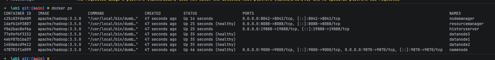
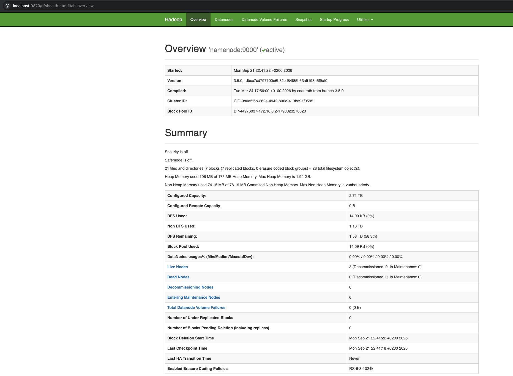
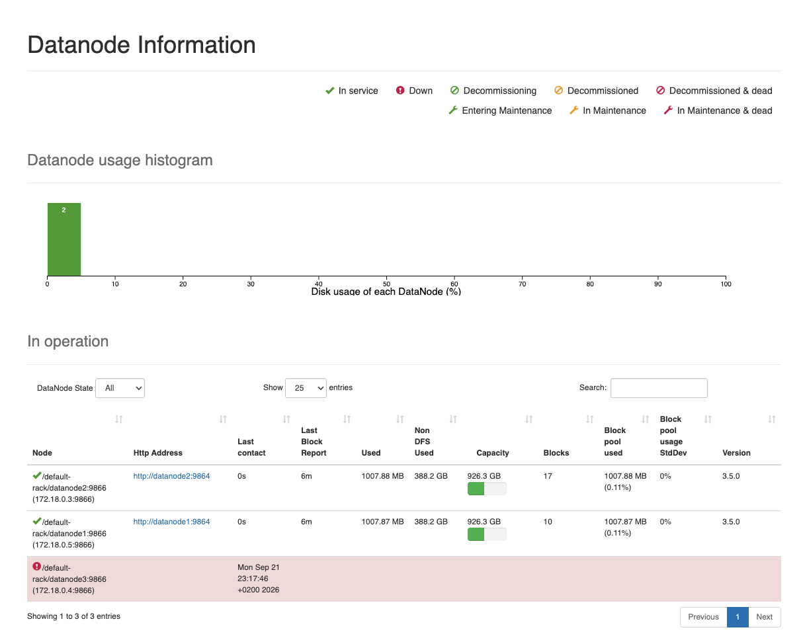

# ДЗ 1. Введение в Большие Данные

## Формулировка задания

**Цель**: понять принципы распределённого хранения и отличия от классических СУБД.

**Задание**:  развернуть псевдокластер Hadoop локально или в Docker. Убедиться, что NameNode и DataNode поднялись, и
открыть
веб-интерфейс NameNode.

**Данные**: загрузить в HDFS датасет не меньше 1 ГБ. Посмотреть, на сколько блоков он разбился и на каких узлах лежат
реплики каждого блока.

**Эксперименты**: изменить размер блока и replication factor, сравнить число блоков и занятое место. Симулировать отказ
DataNode и проследить восстановление реплик.

**Форма отчётности**: объяснить своими словами, как HDFS обеспечивает надёжность и масштабируемость. Приложить команды,
вывод консоли и выводы по каждому эксперименту.

**Критерии оценивания (max 6 б.)**: кластер запущен и доступен, датасет ≥1 ГБ успешно загружен в HDFS,
продемонстрированы и
объяснены параметры репликации и block size, симулировано падение узла с подтверждением автоматического восстановления
данных, отчёт содержит корректное объяснение механизмов обеспечения надёжности и масштабируемости HDFS.

# Решение

## Развертывание кластера

Файл `compose.yaml`

```yaml
x-datanode: &datanode
  image: apache/hadoop:3.5.0
  restart: always
  command: [ "hdfs", "datanode" ]
  env_file:
    - ./hadoop.env
  healthcheck:
    test: [ "CMD-SHELL", "bash -c '</dev/tcp/localhost/9864'" ]
    interval: 10s
    retries: 12
  depends_on:
    namenode:
      condition: service_healthy

services:
  volume-init:
    image: busybox
    command: [ "sh", "-c", "chown -R 1001:1001 /data" ]
    volumes:
      - ./data:/data

  namenode:
    image: apache/hadoop:3.5.0
    container_name: namenode
    hostname: namenode
    restart: always
    command: [ "hdfs", "namenode" ]
    ports:
      - "9870:9870"   # HDFS web UI
      - "9000:9000"   # HDFS RPC
    env_file:
      - ./hadoop.env
    environment:
      ENSURE_NAMENODE_DIR: "/hadoop/dfs/name/current"
    volumes:
      - ./data/namenode:/hadoop/dfs/name
    healthcheck:
      test: [ "CMD-SHELL", "bash -c '</dev/tcp/localhost/9870'" ]
      interval: 10s
      retries: 12
    depends_on:
      volume-init:
        condition: service_completed_successfully

  datanode1:
    <<: *datanode
    container_name: datanode1
    hostname: datanode1
    volumes:
      - ./data/datanode1:/hadoop/dfs/data

  datanode2:
    <<: *datanode
    container_name: datanode2
    hostname: datanode2
    volumes:
      - ./data/datanode2:/hadoop/dfs/data

  datanode3:
    <<: *datanode
    container_name: datanode3
    hostname: datanode3
    volumes:
      - ./data/datanode3:/hadoop/dfs/data

  resourcemanager:
    image: apache/hadoop:3.5.0
    container_name: resourcemanager
    hostname: resourcemanager
    restart: always
    command: [ "yarn", "resourcemanager" ]
    ports:
      - "8088:8088"
    env_file:
      - ./hadoop.env
    #    volumes:
    #      - ../jobs:/opt/jobs
    healthcheck:
      test: [ "CMD-SHELL", "bash -c '</dev/tcp/resourcemanager/8088'" ]
      interval: 10s
      retries: 12
    depends_on:
      datanode1:
        condition: service_healthy

  nodemanager:
    image: apache/hadoop:3.5.0
    container_name: nodemanager
    restart: always
    command: [ "yarn", "nodemanager" ]
    ports:
      - "8042:8042"
    env_file:
      - ./hadoop.env
    depends_on:
      resourcemanager:
        condition: service_healthy

  historyserver:
    image: apache/hadoop:3.5.0
    container_name: historyserver
    hostname: historyserver
    restart: always
    command: [ "mapred", "historyserver" ]
    ports:
      - "19888:19888"
    env_file:
      - ./hadoop.env
    depends_on:
      datanode1:
        condition: service_healthy
```

Файл hadoop.env

```
# core
CORE-SITE.XML_fs.defaultFS=hdfs://namenode:9000
CORE-SITE.XML_hadoop.http.staticuser.user=hadoop

# hdfs
HDFS-SITE.XML_dfs.namenode.rpc-address=namenode:9000
HDFS-SITE.XML_dfs.namenode.name.dir=/hadoop/dfs/name
HDFS-SITE.XML_dfs.datanode.data.dir=/hadoop/dfs/data
HDFS-SITE.XML_dfs.replication=1
HDFS-SITE.XML_dfs.permissions.enabled=false
HDFS-SITE.XML_dfs.namenode.heartbeat.recheck-interval=5000
HDFS-SITE.XML_dfs.heartbeat.interval=3

# yarn
YARN-SITE.XML_yarn.resourcemanager.hostname=resourcemanager
YARN-SITE.XML_yarn.resourcemanager.recovery.enabled=true
YARN-SITE.XML_yarn.resourcemanager.store.class=org.apache.hadoop.yarn.server.resourcemanager.recovery.FileSystemRMStateStore
YARN-SITE.XML_yarn.resourcemanager.fs.state-store.uri=/rmstate
YARN-SITE.XML_yarn.nodemanager.aux-services=mapreduce_shuffle
YARN-SITE.XML_yarn.nodemanager.pmem-check-enabled=false
YARN-SITE.XML_yarn.nodemanager.vmem-check-enabled=false
YARN-SITE.XML_yarn.log-aggregation-enable=true
YARN-SITE.XML_yarn.nodemanager.remote-app-log-dir=/app-logs
YARN-SITE.XML_yarn.log.server.url=http://localhost:19888/jobhistory/logs

# mapreduce
MAPRED-SITE.XML_mapreduce.framework.name=yarn
MAPRED-SITE.XML_yarn.app.mapreduce.am.env=HADOOP_MAPRED_HOME=$HADOOP_HOME
MAPRED-SITE.XML_mapreduce.map.env=HADOOP_MAPRED_HOME=$HADOOP_HOME
MAPRED-SITE.XML_mapreduce.reduce.env=HADOOP_MAPRED_HOME=$HADOOP_HOME
MAPRED-SITE.XML_mapreduce.map.output.compress=true
MAPRED-SITE.XML_mapreduce.map.output.compress.codec=org.apache.hadoop.io.compress.SnappyCodec
MAPRED-SITE.XML_mapreduce.jobhistory.address=historyserver:10020
MAPRED-SITE.XML_mapreduce.jobhistory.webapp.address=historyserver:19888

# capacity scheduler
CAPACITY-SCHEDULER.XML_yarn.scheduler.capacity.root.queues=default
CAPACITY-SCHEDULER.XML_yarn.scheduler.capacity.root.default.capacity=100
CAPACITY-SCHEDULER.XML_yarn.scheduler.capacity.root.default.maximum-capacity=100
CAPACITY-SCHEDULER.XML_yarn.scheduler.capacity.root.default.state=RUNNING
CAPACITY-SCHEDULER.XML_yarn.scheduler.capacity.root.default.acl_submit_applications=*
CAPACITY-SCHEDULER.XML_yarn.scheduler.capacity.maximum-am-resource-percent=0.5
```

ps: у нас был курс, где нужно было поднять кластер, потому файлы частично взяты от туда и не являются минимально
необходимыми для выполнения этого задания.

### Поднимаем

```shell
docker compose up -d
docker ps
```



Веб интерфейс namenode.


## Загрузка данных

```shell
docker exec -it datanode3 sh
dd if=/dev/urandom of=test.bin bs=1M count=1000 # 1048576000 bytes (1.0 GB, 1000 MiB) copied, 1.33576 s, 785 MB/s
hdfs dfs -mkdir -p /test1
hdfs dfs -put test.bin /test1/ 
hdfs fsck /test1/test.bin -files -blocks -locations
```

Результат: 8 блоков (размер блока по умолчанию ~134MB), фактор репликации 1.

Посмотреть размер блока можно:

```shell
docker exec namenode hdfs getconf -confKey dfs.blocksize
# or 
http://localhost:9870/conf # => dfs.blocksize
```

Вывод fsck

```
Connecting to namenode via http://namenode:9870/fsck?ugi=hadoop&files=1&blocks=1&locations=1&path=%2Ftest1%2Ftest.bin
FSCK started by hadoop (auth:SIMPLE) from /172.18.0.5 for path /test1/test.bin at Mon Sep 21 20:51:37 UTC 2026

/test1/test.bin 1048576000 bytes, replicated: replication=1, 8 block(s):  OK
0. BP-44976937-172.18.0.2-1790023278820:blk_1073741832_1008 len=134217728 Live_repl=1  [DatanodeInfoWithStorage[172.18.0.5:9866,DS-7f32cc78-69c5-413f-bb92-8bbe983489aa,DISK]]
1. BP-44976937-172.18.0.2-1790023278820:blk_1073741833_1009 len=134217728 Live_repl=1  [DatanodeInfoWithStorage[172.18.0.5:9866,DS-7f32cc78-69c5-413f-bb92-8bbe983489aa,DISK]]
2. BP-44976937-172.18.0.2-1790023278820:blk_1073741834_1010 len=134217728 Live_repl=1  [DatanodeInfoWithStorage[172.18.0.5:9866,DS-7f32cc78-69c5-413f-bb92-8bbe983489aa,DISK]]
3. BP-44976937-172.18.0.2-1790023278820:blk_1073741835_1011 len=134217728 Live_repl=1  [DatanodeInfoWithStorage[172.18.0.5:9866,DS-7f32cc78-69c5-413f-bb92-8bbe983489aa,DISK]]
4. BP-44976937-172.18.0.2-1790023278820:blk_1073741836_1012 len=134217728 Live_repl=1  [DatanodeInfoWithStorage[172.18.0.5:9866,DS-7f32cc78-69c5-413f-bb92-8bbe983489aa,DISK]]
5. BP-44976937-172.18.0.2-1790023278820:blk_1073741837_1013 len=134217728 Live_repl=1  [DatanodeInfoWithStorage[172.18.0.5:9866,DS-7f32cc78-69c5-413f-bb92-8bbe983489aa,DISK]]
6. BP-44976937-172.18.0.2-1790023278820:blk_1073741838_1014 len=134217728 Live_repl=1  [DatanodeInfoWithStorage[172.18.0.5:9866,DS-7f32cc78-69c5-413f-bb92-8bbe983489aa,DISK]]
7. BP-44976937-172.18.0.2-1790023278820:blk_1073741839_1015 len=109051904 Live_repl=1  [DatanodeInfoWithStorage[172.18.0.5:9866,DS-7f32cc78-69c5-413f-bb92-8bbe983489aa,DISK]]


Status: HEALTHY
 Number of data-nodes:  3
 Number of racks:               1
 Total dirs:                    0
 Total symlinks:                0

Replicated Blocks:
 Total size:    1048576000 B
 Total files:   1
 Total blocks (validated):      8 (avg. block size 131072000 B)
 Minimally replicated blocks:   8 (100.0 %)
 Over-replicated blocks:        0 (0.0 %)
 Under-replicated blocks:       0 (0.0 %)
 Mis-replicated blocks:         0 (0.0 %)
 Default replication factor:    1
 Average block replication:     1.0
 Missing blocks:                0
 Corrupt blocks:                0
 Missing replicas:              0 (0.0 %)
 Blocks queued for replication: 0

Erasure Coded Block Groups:
 Total size:    0 B
 Total files:   0
 Total block groups (validated):        0
 Minimally erasure-coded block groups:  0
 Over-erasure-coded block groups:       0
 Under-erasure-coded block groups:      0
 Unsatisfactory placement block groups: 0
 Average block group size:      0.0
 Missing block groups:          0
 Corrupt block groups:          0
 Missing internal blocks:       0
 Blocks queued for replication: 0
FSCK ended at Mon Sep 21 20:51:37 UTC 2026 in 19 milliseconds

The filesystem under path '/test1/test.bin' is HEALTHY
```

## Эксперименты

## Изменение replication factor и отказ

```shell
docker exec -it datanode3 sh
hdfs dfs -setrep -w 2 /test1/test.bin
hdfs fsck /test1/test.bin -files -blocks -locations
```

Файл реплицировался на еще одну ноду.

```shell
/test1/test.bin 1048576000 bytes, replicated: replication=2, 8 block(s):  OK
0. BP-44976937-172.18.0.2-1790023278820:blk_1073741832_1008 len=134217728 Live_repl=2  [DatanodeInfoWithStorage[172.18.0.5:9866,DS-7f32cc78-69c5-413f-bb92-8bbe983489aa,DISK], DatanodeInfoWithStorage[172.18.0.3:9866,DS-8e8adb28-3f9f-4b79-a87c-323af13bff7d,DISK]]
1. BP-44976937-172.18.0.2-1790023278820:blk_1073741833_1009 len=134217728 Live_repl=2  [DatanodeInfoWithStorage[172.18.0.5:9866,DS-7f32cc78-69c5-413f-bb92-8bbe983489aa,DISK], DatanodeInfoWithStorage[172.18.0.3:9866,DS-8e8adb28-3f9f-4b79-a87c-323af13bff7d,DISK]]
2. BP-44976937-172.18.0.2-1790023278820:blk_1073741834_1010 len=134217728 Live_repl=2  [DatanodeInfoWithStorage[172.18.0.5:9866,DS-7f32cc78-69c5-413f-bb92-8bbe983489aa,DISK], DatanodeInfoWithStorage[172.18.0.4:9866,DS-fb42b1a1-3b4b-4696-acb2-0a22ee394da3,DISK]]
3. BP-44976937-172.18.0.2-1790023278820:blk_1073741835_1011 len=134217728 Live_repl=2  [DatanodeInfoWithStorage[172.18.0.5:9866,DS-7f32cc78-69c5-413f-bb92-8bbe983489aa,DISK], DatanodeInfoWithStorage[172.18.0.4:9866,DS-fb42b1a1-3b4b-4696-acb2-0a22ee394da3,DISK]]
4. BP-44976937-172.18.0.2-1790023278820:blk_1073741836_1012 len=134217728 Live_repl=2  [DatanodeInfoWithStorage[172.18.0.5:9866,DS-7f32cc78-69c5-413f-bb92-8bbe983489aa,DISK], DatanodeInfoWithStorage[172.18.0.4:9866,DS-fb42b1a1-3b4b-4696-acb2-0a22ee394da3,DISK]]
5. BP-44976937-172.18.0.2-1790023278820:blk_1073741837_1013 len=134217728 Live_repl=2  [DatanodeInfoWithStorage[172.18.0.5:9866,DS-7f32cc78-69c5-413f-bb92-8bbe983489aa,DISK], DatanodeInfoWithStorage[172.18.0.4:9866,DS-fb42b1a1-3b4b-4696-acb2-0a22ee394da3,DISK]]
6. BP-44976937-172.18.0.2-1790023278820:blk_1073741838_1014 len=134217728 Live_repl=2  [DatanodeInfoWithStorage[172.18.0.5:9866,DS-7f32cc78-69c5-413f-bb92-8bbe983489aa,DISK], DatanodeInfoWithStorage[172.18.0.4:9866,DS-fb42b1a1-3b4b-4696-acb2-0a22ee394da3,DISK]]
7. BP-44976937-172.18.0.2-1790023278820:blk_1073741839_1015 len=109051904 Live_repl=2  [DatanodeInfoWithStorage[172.18.0.5:9866,DS-7f32cc78-69c5-413f-bb92-8bbe983489aa,DISK], DatanodeInfoWithStorage[172.18.0.4:9866,DS-fb42b1a1-3b4b-4696-acb2-0a22ee394da3,DISK]]
```

Файл стал занимать 2GB реальной памяти.

```shell
hdfs dfs -du /test1/test.bin
# 1048576000  2097152000  /test1/test.bin
```

### Симулираем отказ datanode3 (172.18.0.4).

PS: тут я перезапустил compose, чтобы отредактировать heartbeat, поэтому datanode3, стала 172.18.0.4 вместо 172.18.0.5.

```shell
docker stop datanode3
docker ps | grep datanode
# 2ec240c827c5   apache/hadoop:3.5.0   "/usr/local/bin/dumb…"   4 minutes ago   Up 4 minutes (healthy) datanode1
# 2b9d4f6076e1   apache/hadoop:3.5.0   "/usr/local/bin/dumb…"   4 minutes ago   Up 4 minutes (healthy) datanode2
```

```shell
docker exec -it datanode1 sh
hdfs dfs -setrep -w 2 /test1/test.bin
```

Hadoop определил, что datanode3 недоступна и данные отреплицировались на datanode1 (172.18.0.5)

```shell
/test1/test.bin 1048576000 bytes, replicated: replication=2, 8 block(s):  OK
0. BP-44976937-172.18.0.2-1790023278820:blk_1073741832_1008 len=134217728 Live_repl=2  [DatanodeInfoWithStorage[172.18.0.3:9866,DS-8e8adb28-3f9f-4b79-a87c-323af13bff7d,DISK], DatanodeInfoWithStorage[172.18.0.5:9866,DS-fb42b1a1-3b4b-4696-acb2-0a22ee394da3,DISK]]
1. BP-44976937-172.18.0.2-1790023278820:blk_1073741833_1009 len=134217728 Live_repl=2  [DatanodeInfoWithStorage[172.18.0.3:9866,DS-8e8adb28-3f9f-4b79-a87c-323af13bff7d,DISK], DatanodeInfoWithStorage[172.18.0.5:9866,DS-fb42b1a1-3b4b-4696-acb2-0a22ee394da3,DISK]]
2. BP-44976937-172.18.0.2-1790023278820:blk_1073741834_1010 len=134217728 Live_repl=2  [DatanodeInfoWithStorage[172.18.0.5:9866,DS-fb42b1a1-3b4b-4696-acb2-0a22ee394da3,DISK], DatanodeInfoWithStorage[172.18.0.3:9866,DS-8e8adb28-3f9f-4b79-a87c-323af13bff7d,DISK]]
3. BP-44976937-172.18.0.2-1790023278820:blk_1073741835_1011 len=134217728 Live_repl=2  [DatanodeInfoWithStorage[172.18.0.5:9866,DS-fb42b1a1-3b4b-4696-acb2-0a22ee394da3,DISK], DatanodeInfoWithStorage[172.18.0.3:9866,DS-8e8adb28-3f9f-4b79-a87c-323af13bff7d,DISK]]
4. BP-44976937-172.18.0.2-1790023278820:blk_1073741836_1012 len=134217728 Live_repl=2  [DatanodeInfoWithStorage[172.18.0.5:9866,DS-fb42b1a1-3b4b-4696-acb2-0a22ee394da3,DISK], DatanodeInfoWithStorage[172.18.0.3:9866,DS-8e8adb28-3f9f-4b79-a87c-323af13bff7d,DISK]]
5. BP-44976937-172.18.0.2-1790023278820:blk_1073741837_1013 len=134217728 Live_repl=2  [DatanodeInfoWithStorage[172.18.0.5:9866,DS-fb42b1a1-3b4b-4696-acb2-0a22ee394da3,DISK], DatanodeInfoWithStorage[172.18.0.3:9866,DS-8e8adb28-3f9f-4b79-a87c-323af13bff7d,DISK]]
6. BP-44976937-172.18.0.2-1790023278820:blk_1073741838_1014 len=134217728 Live_repl=2  [DatanodeInfoWithStorage[172.18.0.5:9866,DS-fb42b1a1-3b4b-4696-acb2-0a22ee394da3,DISK], DatanodeInfoWithStorage[172.18.0.3:9866,DS-8e8adb28-3f9f-4b79-a87c-323af13bff7d,DISK]]
7. BP-44976937-172.18.0.2-1790023278820:blk_1073741839_1015 len=109051904 Live_repl=2  [DatanodeInfoWithStorage[172.18.0.5:9866,DS-fb42b1a1-3b4b-4696-acb2-0a22ee394da3,DISK], DatanodeInfoWithStorage[172.18.0.3:9866,DS-8e8adb28-3f9f-4b79-a87c-323af13bff7d,DISK]]
```



### Восстанавливаем ноду

Лишняя копия данных была удалена автоматически.

```shell
docker start datanode3
docker exec -it datanode1 sh
hdfs dfs -du /test1/test.bin
# 1048576000  2097152000  /test1/test.bin
```

Вывод - hadoop автоматически отслеживает состояние datanode, при необходимости перенося данные, при этом не оставляет
over-replicated данные на долгое время.

## Изменение размера блока

Создадим файл с размером блока 512MB

```shell
docker exec -it datanode1 sh
hdfs dfs -D dfs.blocksize=512M -cp /test1/test.bin /test1/test-512.bin 
```

Получаем 2 блока, фактически занимаемое место на реплику данных не изменилось.

```shell
hdfs fsck /test1/test-512.bin -files -blocks -locations
# /test1/test-512.bin 1048576000 bytes, replicated: replication=1, 2 block(s):  OK
# 0. BP-44976937-172.18.0.2-1790023278820:blk_1073741855_1031 len=536870912 Live_repl=1  [DatanodeInfoWithStorage[172.18.0.5:9866,DS-fb42b1a1-3b4b-4696-acb2-0a22ee394da3,DISK]]
# 1. BP-44976937-172.18.0.2-1790023278820:blk_1073741856_1032 len=511705088 Live_repl=1  [DatanodeInfoWithStorage[172.18.0.5:9866,DS-fb42b1a1-3b4b-4696-acb2-0a22ee394da3,DISK]]

hdfs dfs -du /test1
# 1048576000  1048576000  /test1/test-512.bin
# 1048576000  2097152000  /test1/test.bin
```

Вывод: размер блока не влияет на фактически занимаемое место, тк в случае зазора по месту блок заполняется не полностью
(eg. 511705088).

## Мини-отчет

> как HDFS обеспечивает надёжность и масштабируемость

### Надежность

Файл режется на блоки. Каждый блок хранится в нескольких копиях на разных datanode, число копий задается через параметр
replication-factor.
NameNode следит за состоянием datanodes через heartbeat'ы, если datanode'а слишком долго не присылает hearbeat datanode
начинает считать его "мертвым" и дореплицирует данные на другую ноду. При восстановлении во избежание излишнего
дублирования данных namenode инициирует удаление лишних копий.

Для обеспечения надежности самой namenode его тоже реплицируют active-replicas, для контроля используется какой-либо
алгоритм механизм обеспечения консенсуса, например zookeeper.

### Масштабируемость

Разделение метаданных и данных (namenode/datanode) позволяет неплохо масштабировать storage, тк он растет линейно при
добавлении новых datanode. При этом метаданные хранятся в памяти namenode, который нужно либо шардировать (федерации),
либо вертикально масштабировать.
Более крупные блоки снижают частоту обращения к метаданным и позволяют читать файл
последовательно, но нужен баланс, слишком большие блоки сложнее переносить, размещать в системе, а также это может
ограничивать параллелизм, слишком маленькие -
большой overhead на поиск данных и инициализация job'ов.

Пример, когда размер блока мешает размещению.

- у нас есть по 5GB памяти на 3х нодах.
- мы хотим разместить файл размером 6GB при репликации 2
- если поставить размер блока 6GB, то такой блок не вместится ни на один сервер и не сможет быть размещен.
- при этом при размере блока 1GB данные разместить получится, например.
    - datanode1=блоки 1-5
    - datanode2=блок 6 + копия 1-4
    - datanode3=копии 5 и 6
