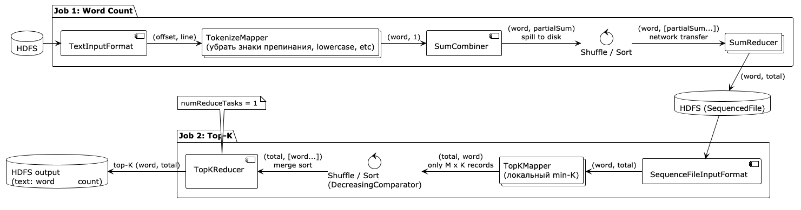

# ДЗ 2. Hadoop экосистема и MapReduce

## Формулировка задания

**Цель**: освоить модель MapReduce и её ограничения.

**Задание**: реализовать задачу подсчёта TF-IDF или топ-N слов по корпусу текстов с использованием Hadoop MapReduce.
Объяснить, как происходит shuffle и sort. Сравнить с локальной реализацией.

**Форма отчетности**: в отчёте должно содержаться описание используемых данных и решаемой задачи, а также реализованного
MapReduce-решения. Необходимо описать работу Mapper и Reducer, привести промежуточные пары (key, value) и объяснить роль
этапа Shuffle/Sort в решении задачи. Также необходимо описать запуск MapReduce-задачи, привести пример полученного
результата и сравнить его с результатом и временем выполнения локальной реализации.

**Критерии (max 6 б.)**: корректная реализация алгоритма TF-IDF или топ-N слов на Hadoop MapReduce, верные результаты
работы
кода, подробное объяснение этапов shuffle и sort, обоснованное сравнение с локальной реализацией, отчет содержит
корректное описание механизмов обеспечения надежности и масштабируемости HDFS.

**Выбранная задача**: `Top-K слов по корпусу текстов`

## Архитектура решения

1. Загружаем набор текстов с HDFS, используем `TextInputFormat`
2. Токенизируем текст в `TokenizeMapper` - слова приводятся к нижнему регистру, цифры знаки препинания и прочее
   выкидываются.
3. Считает локальную сумму по словам в `SumCombiner`
4. Shuffle and sort
5. Считаем глобальную сумму по словам, на данном этапе у нас набор файлов с KV <слово, количество>
6. Сбрасываем на диск и запускаем вторую джобу
7. Вычитываем данные в формате для KV `SequenceFileInputFormat`
8. Маппер в памяти держит top-k при помощи heap, при завершении сбрасывает кучу в output. Исходим из того, что K не
   огромно и помещается в памяти одного маппера
9. Shuffle and sort
10. `TopKReducer` делает merge sort по массивам и сохраняет результат. Число reducer'ов = 1, для того, чтобы получить
    финальный результат.



## Инфраструктура

Hadoop в докере с прошлой лабы, подробнее - [compose.yaml](compose.yaml) и [hadoop.env](hadoop.env)

## Используемые данные

Для анализа используется 10 книг на английском языке, размер файлов небольшой, но нам хватит.

Названия и размер книг [books.csv](books.csv).

```shell
chmod +x download_books.sh
./download_books.sh
```

Загружаем данные в hdfs

```shell
docker exec -it namenode sh
hdfs dfs -put /opt/input /input/books
hdfs dfs -ls /input/books
```

